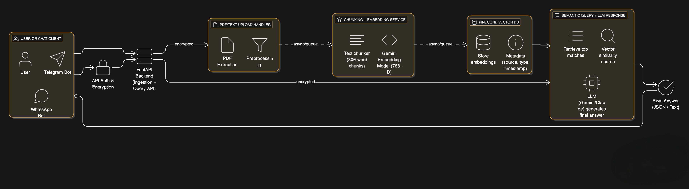

# Knowledge Engine — RAG Search with FastAPI, Pinecone & Gemini

A production-ready Retrieval-Augmented Generation (RAG) service that ingests PDFs and text, embeds them using Gemini embeddings, stores them in Pinecone, and exposes FastAPI endpoints for semantic search.

This powers internal knowledge bases, chatbots, customer-support assistants, and personalized AI tools.

---

## 🧩 Features

- PDF ingestion → text extraction → chunking
- Gemini embeddings (768 dim)
- Pinecone vector storage
- Text learning via POST `/add-text`
- Semantic search via POST `/query`
- Fully modular FastAPI backend
- Works with Telegram bots, WhatsApp bots, n8n, or any client

---

## 💡 Real-World Use Cases

- AI support assistant for product documentation
- Internal knowledge base search for teams
- AI chatbot with personalized memory
- Automated FAQ responder for websites
- Context-aware WhatsApp or Telegram bot
- Knowledge-driven email automation

---

## 🏗️ Architecture



---

## 🚀 API Endpoints

### `POST /upload-pdf`

Upload PDFs → auto chunk → embed → store in Pinecone.

### `POST /add-text`

Store manual text (notes, instructions, documents).

### `POST /query`

Query knowledge base with optional metadata filters.

---

### Example: Querying the RAG Engine with Metadata Filter

curl -X POST http://localhost:8000/query \
 -F "query=What is the refund policy?" \
 -F "type_filter=manual" \
 -F "source_filter=product-docs"

---

## 📁 Project Structure

```
rag-knowledge-engine/
│── featured-assets/
│   └── architecture.png
│── main.py
│── requirements.txt
│── .gitignore
│── README.md
```

---

## ⚙️ Tech Stack

- FastAPI
- Pinecone (v3)
- Gemini Embeddings
- pdfplumber
- Docker-ready
- n8n (optional)
- Telegram Bots (optional)
- Anthropic Claude (optional)

---

## 📦 Quickstart

1. Clone repo

   ```bash
   git clone https://github.com/atulsingh369/rag-knowledge-engine.git
   cd rag-knowledge-engine
   ```

2. Set up environment variables  
   Create a `.env` file with:

   ```
   PINECONE_API_KEY=your-pinecone-key
   PINECONE_ENVIRONMENT=your-pinecone-env
   GEMINI_API_KEY=your-gemini-key
   ANTHROPIC_API_KEY=your-anthropic-key
   ```

3. Install dependencies

   ```bash
   pip install -r requirements.txt
   ```

4. Run FastAPI
   ```bash
   uvicorn main:app --host 0.0.0.0 --port 8000
   ```

---

## 🔧 Configuration

- **Pinecone**: Create a Pinecone index with 768 dimensions.
- **Gemini**: Get an API key from [Google AI Studio](https://ai.google.dev/).
- **Anthropic**: Get an API key from [Anthropic](https://www.anthropic.com/).

---

## 🤝 Contributing

Contributions are welcome! Please open an issue or submit a pull request.

---

## 📄 License

This project is licensed under the MIT License.

---
